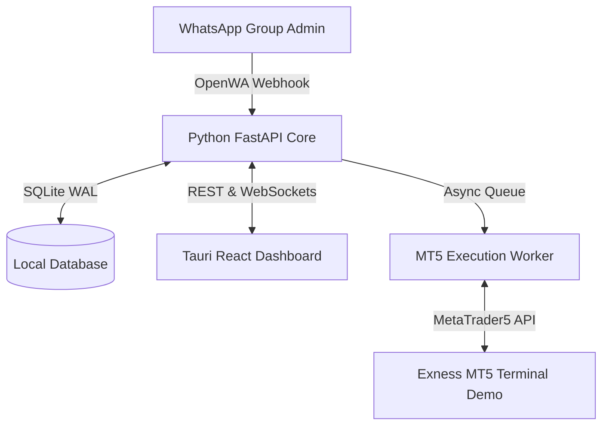

# WhatsApp to MT5 XAUUSD Trading Bot

A production-oriented, high-reliability Windows desktop application that converts approved WhatsApp group trading signals into MetaTrader 5 (MT5) pending order grids and manages position lifecycles on an Exness hedging account.

---

> [!CAUTION]
> ### Safety & Risk Notice
> **DO NOT RUN THIS APPLICATION AGAINST A LIVE TRADING ACCOUNT.**  
> This software is strictly intended for operation on an **Exness MT5 Demo Account**. Trading spot gold (XAUUSD) carries substantial financial risk. The developers assume no responsibility for financial losses incurred through the use of this software.

---

## Project Purpose

The primary objective of this system is to provide an automated, safe, and transparent bridge between WhatsApp group trade signals posted by a verified group administrator and MetaTrader 5 order execution. Key features include:

- **Ingestion**: Listens to one approved WhatsApp group and verifies admin sender identity.
- **Parsing**: Parses entry ranges (`4120-4128`), Stop Losses, Take Profits, and follow-up management commands.
- **Grid Generation**: Calculates evenly spaced entry ladders (3 to 8 entries) with strict exposure limits ($\le 2.00$ total lots).
- **TP Allocation**: Deterministically assigns positions to Signal TP1, Signal TP2, and fixed 100-pip targets.
- **Execution Modes**: Supports **Fully Automatic** execution or **Confirmation Mode** via a modern Tauri React desktop UI.
- **Reliability & Recovery**: Local SQLite WAL persistence, single execution queue, and startup reconciliation to eliminate duplicate order placement.

---

## Current Phase

- **Current Status**: **Phase 1 of 12 — Requirements and Architecture Freeze**
- **Phase Objective**: Complete documentation freeze (requirements, architecture, data model, state machine, trading rules, command classification, safety controls, roadmap).
- **Implementation Status**: **Documentation Only**. No application code has been written, no dependencies installed, and no project scaffolding initialized yet.

---

## Architecture Summary

- **Frontend**: Tauri v2 / Rust shell + React 18 Desktop Dashboard.
- **Backend Core**: Python 3.11+ / FastAPI / SQLAlchemy.
- **WhatsApp Ingestion**: Node.js OpenWA worker.
- **MT5 Interface**: Official Python `MetaTrader5` package.
- **Database**: SQLite 3 (WAL mode).

---

## Confirmed Restrictions & Safety Rules

1. **XAUUSD Only**: Strictly restricts trading to `XAUUSD` / `Gold`.
2. **Hedging Account Required**: Locks execution if connected to an MT5 Netting account.
3. **Single Admin & Group**: Accepts signals exclusively from the designated group administrator.
4. **Lot Sizing Ceiling**: Capped at **2.00 total lots** per campaign ($N \times \text{Lot} \le 2.00$). Execution is blocked if limit is exceeded.
5. **Entry Count**: Adjustable between 3 and 8 entries (default: 5).

---

## Documentation Registry

Comprehensive system documentation is located in the `docs/` folder:

- 📋 [REQUIREMENTS.md](file:///c:/Users/Pavan%20Teja/projects/whatsapp_trading%20bot/docs/REQUIREMENTS.md) — Functional, non-functional, and safety requirements.
- 🏗️ [ARCHITECTURE.md](file:///c:/Users/Pavan%20Teja/projects/whatsapp_trading%20bot/docs/ARCHITECTURE.md) — System boundaries, components, sequence diagrams, and interfaces.
- 📈 [TRADING_RULES.md](file:///c:/Users/Pavan%20Teja/projects/whatsapp_trading%20bot/docs/TRADING_RULES.md) — Entry ladder formulas, lot distribution, and TP mapping.
- 🗣️ [COMMAND_CLASSIFICATION.md](file:///c:/Users/Pavan%20Teja/projects/whatsapp_trading%20bot/docs/COMMAND_CLASSIFICATION.md) — Classification breakdown of admin messages.
- 🔄 [CAMPAIGN_STATE_MACHINE.md](file:///c:/Users/Pavan%20Teja/projects/whatsapp_trading%20bot/docs/CAMPAIGN_STATE_MACHINE.md) — FSM states, transitions, and recovery behavior.
- 🗄️ [DATA_MODEL.md](file:///c:/Users/Pavan%20Teja/projects/whatsapp_trading%20bot/docs/DATA_MODEL.md) — SQLite schema, ER diagram, and table definitions.
- 🛡️ [SECURITY_AND_SAFETY.md](file:///c:/Users/Pavan%20Teja/projects/whatsapp_trading%20bot/docs/SECURITY_AND_SAFETY.md) — Safety guards, exposure caps, and emergency controls.
- ✅ [ACCEPTANCE_CRITERIA.md](file:///c:/Users/Pavan%20Teja/projects/whatsapp_trading%20bot/docs/ACCEPTANCE_CRITERIA.md) — Given/When/Then test scenarios.
- ❓ [OPEN_DECISIONS.md](file:///c:/Users/Pavan%20Teja/projects/whatsapp_trading%20bot/docs/OPEN_DECISIONS.md) — Unresolved decision tracking log.
- 🗺️ [IMPLEMENTATION_ROADMAP.md](file:///c:/Users/Pavan%20Teja/projects/whatsapp_trading%20bot/docs/IMPLEMENTATION_ROADMAP.md) — 12-phase development schedule.
- 📌 [ASSUMPTIONS.md](file:///c:/Users/Pavan%20Teja/projects/whatsapp_trading%20bot/docs/ASSUMPTIONS.md) — Confirmed facts, technical assumptions, and defaults.
