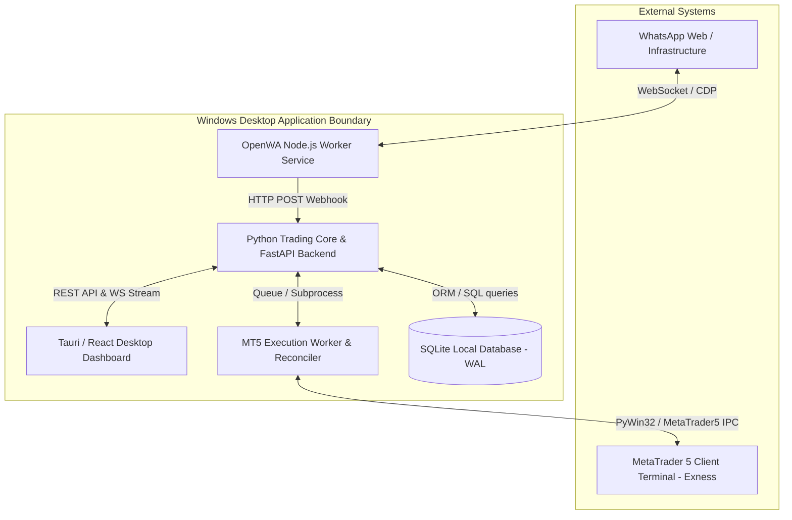
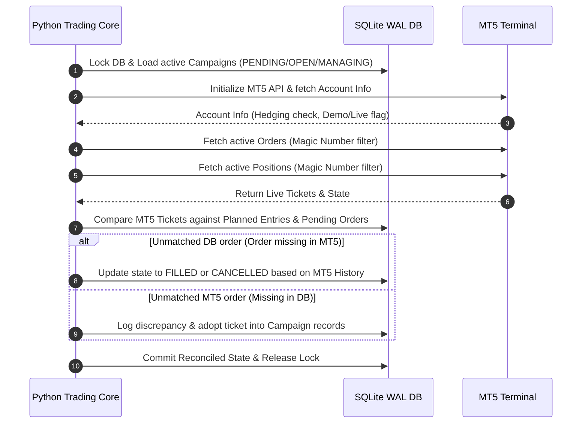
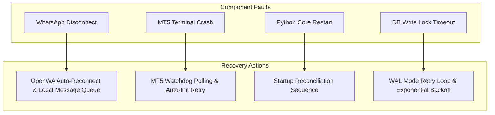

# System Architecture Specification — WhatsApp to MT5 XAUUSD Trading System

Document Version: 1.0.0 (Phase 1 Freeze)  
Status: Approved & Frozen  

---

## 1. System Context & Overview

The system is a local Windows desktop application designed to bridge WhatsApp signal messages from an authorized group administrator to MetaTrader 5 (MT5) order execution for `XAUUSD` on an Exness hedging account.



---

## 2. Component Boundaries & Responsibilities

### 2.1 WhatsApp Ingestion Worker (`WA_Worker`)
- **Technology**: Node.js / OpenWA / Puppeteer wrapper.
- **Responsibility**: Authenticate with WhatsApp via QR code scan, maintain persistent session, listen for incoming group chat messages, extract sender JID and payload, and post authorized message events to the Python core webhook.
- **Boundary Constraint**: Does not execute business logic or parse trading signals. Only handles raw protocol ingestion and admin filtering.

### 2.2 Python Trading Core (`FastAPI_Core`)
- **Technology**: Python 3.11+ / FastAPI / Pydantic / SQLAlchemy.
- **Responsibility**:
  - Receive raw messages from `WA_Worker`.
  - Execute deterministic signal and command parsers.
  - Advance campaign state machine (`RECEIVED` $\rightarrow$ `PARSED` $\rightarrow$ `PLANNED` $\rightarrow$ `PENDING` $\rightarrow$ `OPEN`).
  - Calculate entry ladder geometry and TP allocations.
  - Enforce exposure limits ($\le 2.00$ lots) and safety guards.
  - Serve REST API endpoints for Tauri frontend and broadcast WebSocket event streams.

### 2.3 MetaTrader 5 Execution Worker (`MT5_Worker`)
- **Technology**: Python official `MetaTrader5` package.
- **Responsibility**:
  - Serialize MT5 API requests into a strict FIFO execution queue.
  - Send `order_send` commands for limit/stop orders, position modifications (SL/TP update), and position market closes.
  - Perform startup state reconciliation against MT5 live order book and deal history.
- **Boundary Constraint**: Runs in a thread/process lock to guarantee single-threaded MT5 API execution.

### 2.4 Local SQLite Persistence (`DB_Store`)
- **Technology**: SQLite 3 with Write-Ahead Logging (`PRAGMA journal_mode=WAL;`).
- **Responsibility**: Store normalized relational entities (Settings, Raw Messages, Parsed Signals, Campaigns, Planned Entries, Pending Orders, Positions, State Transitions, Audit Logs).
- **Isolation Guarantee**: Uses ACID transactions and unique index constraints to prevent duplicate signal execution.

### 2.5 Desktop Dashboard (`Tauri_UI`)
- **Technology**: Tauri v2 / Rust shell with React 18 frontend.
- **Responsibility**: Display live signal ticker, active campaign cards, entry ladder preview modal, MT5 account connection status, and Emergency Close-All controls.

---

## 3. Communication Protocols

| Source Component | Target Component | Protocol / Format | Purpose |
|---|---|---|---|
| `WA_Worker` | `FastAPI_Core` | HTTP POST (`JSON`) | Webhook payload for incoming admin messages |
| `FastAPI_Core` | `Tauri_UI` | HTTP REST (`JSON`) | User settings, confirmation actions, campaign queries |
| `FastAPI_Core` | `Tauri_UI` | WebSockets (`WSS`) | Real-time state updates, log streaming, PnL updates |
| `FastAPI_Core` | `MT5_Worker` | Async Queue | Thread-safe dispatch of MT5 order execution requests |
| `MT5_Worker` | MT5 Terminal | IPC / DLL C-API | Official `MetaTrader5` Python library call interface |

---

## 4. Startup State Reconciliation Workflow

When the system boots up or recovers from a crash/restart, it must execute a strict reconciliation sequence before accepting new signals:



---

## 5. Failure Boundaries & Resilience Strategy



---

## 6. Abstract Adapter Interfaces

### 6.1 WhatsApp Worker Adapter (`IWhatsAppAdapter`)
```python
from abc import ABC, abstractmethod
from typing import Callable, Awaitable

class IWhatsAppAdapter(ABC):
    @abstractmethod
    async def initialize(self) -> None: ...
    
    @abstractmethod
    async def register_message_handler(self, handler: Callable[[dict], Awaitable[None]]) -> None: ...
    
    @abstractmethod
    async def get_connection_status(self) -> dict: ...
```

### 6.2 MT5 Execution Adapter (`IMT5Adapter`)
```python
from abc import ABC, abstractmethod
from typing import List, Optional
from src.core.models import PendingGridOrder, Position

class IMT5Adapter(ABC):
    @abstractmethod
    def connect(self, account_id: int, server: str) -> bool: ...
    
    @abstractmethod
    def place_pending_order(self, order: PendingGridOrder) -> Optional[int]: ...
    
    @abstractmethod
    def modify_sltp(self, ticket: int, stop_loss: float, take_profit: Optional[float]) -> bool: ...
    
    @abstractmethod
    def close_position(self, ticket: int, volume: Optional[float] = None) -> bool: ...
    
    @abstractmethod
    def fetch_active_orders(self, magic_number: int) -> List[dict]: ...
    
    @abstractmethod
    def fetch_active_positions(self, magic_number: int) -> List[dict]: ...
```
