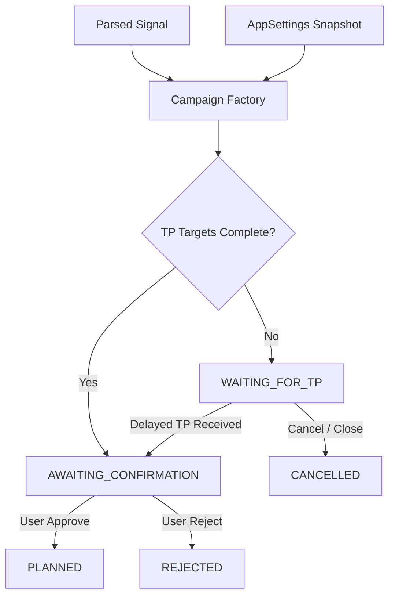

# Campaign Implementation Specification

Document Version: 1.0.0 (Phase 5 Campaign Lifecycle)  
Status: Approved & Implemented  

---

## 1. Campaign Factory & Lifecycle Overview

Campaigns act as persistent orchestration wrappers managing trade signals, user approvals, follow-up command attachments, and state transitions prior to entry ladder planning.

---

## 2. Key Attributes & Concurrency

- **Collision-Safe Campaign Code**: `GOLD-YYYYMMDD-<uuid4_short>` generated transactionally.
- **Magic Number**: Unique random integer identifier assigned per campaign.
- **Optimistic Concurrency**: Atomic version checks (`WHERE id = ? AND version = expected_version`) incrementing `version` on each state mutation to prevent lost updates.
- **No-Execution Guarantee**: Prompt 5 creates planning objects only (`trading_enabled = false`, `execution_performed = false`).
