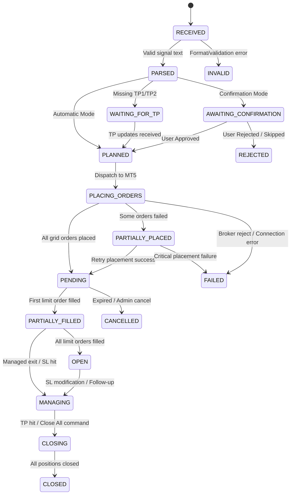

# Campaign State Machine Specification

Document Version: 1.0.0 (Phase 1 Freeze)  
Status: Approved & Frozen  

---

## 1. Overview & State Definitions

Every trading signal lifecycle is managed as an isolated **Campaign** governed by a strict deterministic finite state machine (FSM).

---

## 2. Comprehensive State Catalog

| State Name | Type | Description |
|---|---|---|
| **`RECEIVED`** | Transient | Raw message ingested from WhatsApp, sender verified as Admin, awaiting parsing. |
| **`PARSED`** | Transient | Message text parsed into structured symbol, direction, entry zone, SL, and TPs. |
| **`INVALID`** | Terminal | Message failed parsing, missing mandatory fields (SL/Entry), or rejected by exposure rules ($>2.00$ lots). |
| **`WAITING_FOR_TP`** | Intermediate | Valid entry and SL parsed, but waiting for follow-up message containing TP targets. |
| **`AWAITING_CONFIRMATION`** | Intermediate | Campaign parsed and grid calculated, waiting for user manual approval on dashboard. |
| **`PLANNED`** | Operational | Grid geometry and TP allocations calculated ($N$ entries, per-entry lots), ready for MT5 dispatch. |
| **`PLACING_ORDERS`** | Operational | MT5 execution queue actively submitting pending limit/stop orders to terminal. |
| **`PARTIALLY_PLACED`** | Recovery | Subset of $N$ grid orders successfully placed in MT5, but one or more orders failed placement. |
| **`PENDING`** | Operational | All $N$ pending grid orders successfully placed and active in MT5 order book. |
| **`PARTIALLY_FILLED`** | Operational | At least 1 pending limit order triggered into an open market position, while others remain pending. |
| **`OPEN`** | Operational | All $N$ pending grid orders triggered and converted into active open market positions. |
| **`MANAGING`** | Operational | Active campaign receiving follow-up modifications (SL trailing, partial closes, breakeven moves). |
| **`CLOSING`** | Operational | Exit commands or TP/SL triggers actively closing open positions in MT5 terminal. |
| **`CLOSED`** | Terminal | All positions and pending orders fully closed and finalized. PnL locked in database. |
| **`CANCELLED`** | Terminal | Pending grid orders cancelled by Admin follow-up command or user action before filling. |
| **`REJECTED`** | Terminal | User rejected signal during `AWAITING_CONFIRMATION` mode or admin issued skip. |
| **`FAILED`** | Terminal | Unrecoverable MT5 broker error, invalid account state, or persistent execution failure. |

---

## 3. Valid State Transition Matrix

| From State | Allowed Target States | Trigger Event / Condition |
|---|---|---|
| `RECEIVED` | `PARSED`, `INVALID` | Signal parser evaluation |
| `PARSED` | `PLANNED`, `WAITING_FOR_TP`, `AWAITING_CONFIRMATION`, `INVALID` | Mode evaluation & risk guard check |
| `WAITING_FOR_TP` | `PLANNED`, `CANCELLED` | Follow-up TP message received or admin cancel |
| `AWAITING_CONFIRMATION` | `PLANNED`, `REJECTED`, `CANCELLED` | Dashboard user click (Approve/Reject) or Admin command |
| `PLANNED` | `PLACING_ORDERS`, `FAILED` | Core orchestrator dispatches execution queue |
| `PLACING_ORDERS` | `PENDING`, `PARTIALLY_PLACED`, `FAILED` | MT5 order API placement responses |
| `PARTIALLY_PLACED` | `PLACING_ORDERS`, `CANCELLED`, `FAILED` | Retry queue or rollback cancellation |
| `PENDING` | `PARTIALLY_FILLED`, `OPEN`, `CANCELLED` | MT5 market deal notification or order deletion |
| `PARTIALLY_FILLED` | `OPEN`, `MANAGING`, `CLOSING`, `CLOSED` | Additional fills, follow-up command, or SL trigger |
| `OPEN` | `MANAGING`, `CLOSING` | Follow-up SL/TP command or market exit |
| `MANAGING` | `CLOSING`, `CLOSED` | Exit command execution or SL/TP hit |
| `CLOSING` | `CLOSED`, `FAILED` | MT5 deal confirmation of position closures |

---

## 4. Invalid State Transitions (Strictly Prohibited)

The FSM runtime shall throw an explicit `InvalidStateTransitionException` if any of the following occur:
- Direct transition from `RECEIVED` to `OPEN` or `PENDING` without passing through `PLANNED` and `PLACING_ORDERS`.
- Transitioning out of Terminal states (`CLOSED`, `CANCELLED`, `REJECTED`, `FAILED`, `INVALID`).
- Placing MT5 orders while in `AWAITING_CONFIRMATION` state.
- Transitioning to `PLANNED` if exposure check ($N \times \text{Lot} > 2.00$) fails.

---

## 5. Partial Execution & Recovery Handling

If MT5 order placement fails midway through placing $N$ grid orders (e.g. 3 of 5 placed, 4th rejected by broker):
1. FSM moves to `PARTIALLY_PLACED`.
2. Execution worker attempts up to 3 automatic retries with exponential backoff (1s, 3s, 5s).
3. If retries fail:
   - System prompts user on UI dashboard with choices:
     - **Option 1**: Retry placing remaining 2 orders.
     - **Option 2**: Continue campaign with the 3 successfully placed orders.
     - **Option 3**: Cancel all 3 placed orders and set campaign to `CANCELLED`.

---

## 6. Restart Reconciliation Behaviour

Upon system restart, the `Reconciler` inspects database state vs MT5 live state:
- If DB state is `PLACING_ORDERS` or `CLOSING`: Reconciler queries MT5 order/position book by Magic Number to determine actual terminal state and transitions FSM to `PENDING`, `OPEN`, or `CLOSED`.
- If DB state is `AWAITING_CONFIRMATION`: Campaign remains in `AWAITING_CONFIRMATION` upon restart until user acts.
