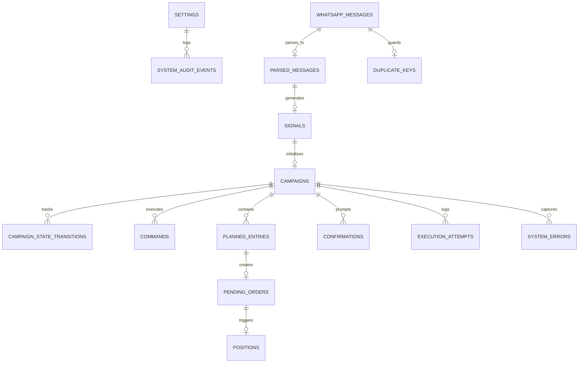

# Data Model & Database Schema Specification

Document Version: 1.0.0 (Phase 1 Freeze)  
Status: Approved & Frozen  

---

## 1. Relational Entity Relationship Diagram

---

## 2. Database Schema & Tables

### 2.1 `app_settings`
Stores user-configurable parameters and environment flags.

| Field Name | Data Type | Constraints | Description |
|---|---|---|---|
| `key` | `TEXT` | `PRIMARY KEY` | Configuration key (e.g. `entry_count`, `lot_per_entry`, `execution_mode`) |
| `value` | `TEXT` | `NOT NULL` | JSON-encoded or scalar string value |
| `updated_at` | `DATETIME` | `NOT NULL` | ISO8601 timestamp of last setting change |

---

### 2.2 `whatsapp_messages`
Raw record of all incoming WhatsApp group messages for audit and deduplication.

| Field Name | Data Type | Constraints | Description |
|---|---|---|---|
| `id` | `TEXT` | `PRIMARY KEY` | WhatsApp message unique ID (`wam_id`) |
| `group_id` | `TEXT` | `NOT NULL, INDEX` | Group chat JID |
| `sender_id` | `TEXT` | `NOT NULL` | Sender phone number / JID |
| `is_admin` | `BOOLEAN` | `NOT NULL` | Flag indicating whether sender passed admin verification |
| `raw_content` | `TEXT` | `NOT NULL` | Full raw message text payload |
| `content_hash` | `TEXT` | `NOT NULL, INDEX` | SHA-256 hash of normalized content for duplicate detection |
| `received_at` | `DATETIME` | `NOT NULL` | System ingestion timestamp |

---

### 2.3 `duplicate_keys`
Idempotency tracking table preventing duplicate order processing.

| Field Name | Data Type | Constraints | Description |
|---|---|---|---|
| `dedup_key` | `TEXT` | `PRIMARY KEY` | Format: `hash(sender_id + timestamp_minute + content_hash)` |
| `message_id` | `TEXT` | `FOREIGN KEY -> whatsapp_messages(id)` | Associated WhatsApp message |
| `created_at` | `DATETIME` | `NOT NULL` | Deduplication timestamp |

---

### 2.4 `parsed_messages`
Structured representation of successfully parsed trading messages.

| Field Name | Data Type | Constraints | Description |
|---|---|---|---|
| `id` | `TEXT` | `PRIMARY KEY` | UUID string |
| `raw_message_id` | `TEXT` | `FOREIGN KEY -> whatsapp_messages(id), UNIQUE` | Source message link |
| `message_type` | `TEXT` | `NOT NULL` | `SIGNAL` or `COMMAND` |
| `parsed_json` | `TEXT` | `NOT NULL` | Full parsed JSON structure |
| `parsed_at` | `DATETIME` | `NOT NULL` | Parsing timestamp |

---

### 2.5 `signals`
Normalized trade signal records.

| Field Name | Data Type | Constraints | Description |
|---|---|---|---|
| `id` | `TEXT` | `PRIMARY KEY` | UUID string |
| `parsed_message_id` | `TEXT` | `FOREIGN KEY -> parsed_messages(id)` | Parser reference |
| `symbol` | `TEXT` | `NOT NULL` | Standardized symbol (`XAUUSD`) |
| `direction` | `TEXT` | `NOT NULL` | `BUY` or `SELL` |
| `entry_min` | `REAL` | `NOT NULL` | Lower bound of entry zone |
| `entry_max` | `REAL` | `NOT NULL` | Upper bound of entry zone |
| `stop_loss` | `REAL` | `NOT NULL` | Hard Stop Loss price |
| `tp1` | `REAL` | `NULLABLE` | Explicit TP1 price target |
| `tp2` | `REAL` | `NULLABLE` | Explicit TP2 price target |
| `has_tp_open` | `BOOLEAN` | `NOT NULL DEFAULT 0` | Flag indicating `TP Open` text was present |
| `created_at` | `DATETIME` | `NOT NULL` | Record creation timestamp |

---

### 2.6 `campaigns`
Top-level campaign entity representing a signal's lifecycle and current state.

| Field Name | Data Type | Constraints | Description |
|---|---|---|---|
| `id` | `TEXT` | `PRIMARY KEY` | Campaign UUID |
| `signal_id` | `TEXT` | `FOREIGN KEY -> signals(id), UNIQUE` | Linked signal |
| `magic_number` | `INTEGER` | `NOT NULL, UNIQUE` | MT5 Magic Number assigned to campaign |
| `current_state` | `TEXT` | `NOT NULL, INDEX` | Active state from Campaign FSM |
| `execution_mode` | `TEXT` | `NOT NULL` | `AUTO` or `CONFIRMATION` |
| `entry_count` | `INTEGER` | `NOT NULL` | Configured entry count (3-8) |
| `lot_per_entry` | `REAL` | `NOT NULL` | Per-entry lot size |
| `total_volume` | `REAL` | `NOT NULL` | `entry_count * lot_per_entry` ($\le 2.00$) |
| `created_at` | `DATETIME` | `NOT NULL` | Creation timestamp |
| `updated_at` | `DATETIME` | `NOT NULL` | Last state transition timestamp |

---

### 2.7 `campaign_state_transitions`
Immutable audit log of all state machine transitions.

| Field Name | Data Type | Constraints | Description |
|---|---|---|---|
| `id` | `INTEGER` | `PRIMARY KEY AUTOINCREMENT` | Internal sequence ID |
| `campaign_id` | `TEXT` | `FOREIGN KEY -> campaigns(id), INDEX` | Target campaign |
| `from_state` | `TEXT` | `NOT NULL` | Previous FSM state |
| `to_state` | `TEXT` | `NOT NULL` | New FSM state |
| `reason` | `TEXT` | `NOT NULL` | Event trigger or reason text |
| `transitioned_at` | `DATETIME` | `NOT NULL` | Exact transition timestamp |

---

### 2.8 `planned_entries`
Calculated price ladder geometry prior to MT5 order creation.

| Field Name | Data Type | Constraints | Description |
|---|---|---|---|
| `id` | `TEXT` | `PRIMARY KEY` | Planned entry UUID |
| `campaign_id` | `TEXT` | `FOREIGN KEY -> campaigns(id), INDEX` | Parent campaign |
| `ladder_index` | `INTEGER` | `NOT NULL` | Ladder position ($0 \dots N-1$) |
| `price` | `REAL` | `NOT NULL` | Target entry price |
| `volume` | `REAL` | `NOT NULL` | Order lot volume |
| `order_type` | `TEXT` | `NOT NULL` | `BUY_LIMIT`, `SELL_LIMIT`, etc. |
| `stop_loss` | `REAL` | `NOT NULL` | Order SL price |
| `take_profit` | `REAL` | `NULLABLE` | Assigned TP (100-pip, TP1, or TP2) |
| `tp_type` | `TEXT` | `NOT NULL` | `FIXED_100_PIP`, `TP1`, or `TP2` |

---

### 2.9 `pending_orders`
Tracks active MT5 pending limit/stop orders.

| Field Name | Data Type | Constraints | Description |
|---|---|---|---|
| `id` | `TEXT` | `PRIMARY KEY` | UUID |
| `campaign_id` | `TEXT` | `FOREIGN KEY -> campaigns(id)` | Parent campaign |
| `planned_entry_id` | `TEXT` | `FOREIGN KEY -> planned_entries(id)` | Linked entry plan |
| `mt5_ticket` | `INTEGER` | `UNIQUE, INDEX` | Broker MT5 order ticket number |
| `price` | `REAL` | `NOT NULL` | Actual order price |
| `volume` | `REAL` | `NOT NULL` | Order lot volume |
| `status` | `TEXT` | `NOT NULL` | `PLACED`, `FILLED`, `CANCELLED` |
| `placed_at` | `DATETIME` | `NOT NULL` | Placement timestamp |

---

### 2.10 `positions`
Tracks filled open market positions in MT5.

| Field Name | Data Type | Constraints | Description |
|---|---|---|---|
| `id` | `TEXT` | `PRIMARY KEY` | Position UUID |
| `campaign_id` | `TEXT` | `FOREIGN KEY -> campaigns(id)` | Parent campaign |
| `pending_order_id` | `TEXT` | `FOREIGN KEY -> pending_orders(id)` | Originating pending order |
| `mt5_position_ticket` | `INTEGER` | `UNIQUE, INDEX` | MT5 position ticket |
| `entry_price` | `REAL` | `NOT NULL` | Actual market fill price |
| `current_sl` | `REAL` | `NOT NULL` | Active Stop Loss |
| `current_tp` | `REAL` | `NULLABLE` | Active Take Profit |
| `volume` | `REAL` | `NOT NULL` | Filled volume |
| `profit` | `REAL` | `NOT NULL DEFAULT 0.0` | Real-time / closed PnL |
| `is_closed` | `BOOLEAN` | `NOT NULL DEFAULT 0` | Closure status |
| `closed_at` | `DATETIME` | `NULLABLE` | Closure timestamp |

---

### 2.11 `commands`
Tracks follow-up commands processed against active campaigns.

| Field Name | Data Type | Constraints | Description |
|---|---|---|---|
| `id` | `TEXT` | `PRIMARY KEY` | Command UUID |
| `campaign_id` | `TEXT` | `FOREIGN KEY -> campaigns(id)` | Targeted campaign |
| `raw_message_id` | `TEXT` | `FOREIGN KEY -> whatsapp_messages(id)` | Source message |
| `command_type` | `TEXT` | `NOT NULL` | `MODIFY_SL`, `CLOSE_PARTIAL`, `CANCEL_PENDING` |
| `parameters_json` | `TEXT` | `NOT NULL` | Extracted parameters |
| `executed_at` | `DATETIME` | `NOT NULL` | Execution timestamp |

---

### 2.12 `confirmations`
Records confirmation mode user prompts and responses.

| Field Name | Data Type | Constraints | Description |
|---|---|---|---|
| `id` | `TEXT` | `PRIMARY KEY` | UUID |
| `campaign_id` | `TEXT` | `FOREIGN KEY -> campaigns(id)` | Targeted campaign |
| `status` | `TEXT` | `NOT NULL` | `PENDING`, `APPROVED`, `REJECTED` |
| `user_action_at` | `DATETIME` | `NULLABLE` | User interaction timestamp |

---

### 2.13 `execution_attempts` & `system_errors` & `system_audit_events`
Audit, log, and error tracking tables for system diagnostic tracing and error reporting.
