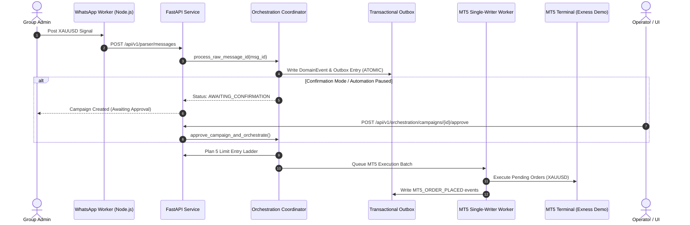

# End-to-End Campaign Lifecycle Flow

```mermaid
sequenceDiagram
    autonumber
    actor WhatsApp as Group Admin
    participant WAWorker as WhatsApp Worker (Node.js)
    participant FastAPI as FastAPI Service
    participant Orch as Orchestration Coordinator
    participant Outbox as Transactional Outbox
    participant MT5Worker as MT5 Single-Writer Worker
    participant MT5 as MT5 Terminal (Exness Demo)

    WhatsApp->>WAWorker: Post XAUUSD Signal
    WAWorker->>FastAPI: POST /api/v1/parser/messages
    FastAPI->>Orch: process_raw_message_id(msg_id)
    Orch->>Outbox: Write DomainEvent & Outbox Entry (ATOMIC)
    alt Confirmation Mode / Automation Paused
        Orch-->>FastAPI: Status: AWAITING_CONFIRMATION
        FastAPI-->>WhatsApp: Campaign Created (Awaiting Approval)
        actor User as Operator / UI
        User->>FastAPI: POST /api/v1/orchestration/campaigns/{id}/approve
        FastAPI->>Orch: approve_campaign_and_orchestrate()
    end
    Orch->>FastAPI: Plan 5 Limit Entry Ladder
    Orch->>MT5Worker: Queue MT5 Execution Batch
    MT5Worker->>MT5: Execute Pending Orders (XAUUSD)
    MT5Worker->>Outbox: Write MT5_ORDER_PLACED events
```
