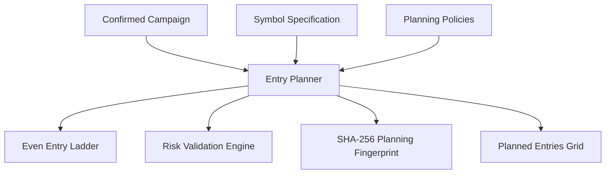

# Entry Planner Specification

Document Version: 1.0.0 (Phase 6 Entry Planner)  
Status: Approved & Implemented  

---

## 1. Overview & Architecture

The Entry Planner converts confirmed XAUUSD trade campaigns into deterministic entry ladder grids, validating risk, allocating Take Profit targets (100-pip, TP1, TP2), and generating stable 31-bit magic numbers and order comments.

---

## 2. Planning Fingerprint & Idempotency

- SHA-256 fingerprint generated over canonical JSON representation of `(campaign_id, campaign_version, planner_version, risk_engine_version, entry_count, lot_per_entry, zone_low, zone_high, stop_loss, tp1, tp2, symbol_spec, policies)`.
- Idempotent request with identical fingerprint returns existing plan without appending duplicate rows.
