# Implementation Roadmap Specification

Document Version: 1.0.0 (Phase 1 Freeze)  
Status: Approved & Frozen  

---

## 1. Executive Roadmap Overview

This project is structured into a strict 12-phase sequential engineering roadmap. Each phase has explicit prerequisites, core deliverables, and verifiable exit criteria.

```mermaid
graph LR
    P1[1. Architecture Freeze] --> P2[2. Scaffold & Dev Env]
    P2 --> P3[3. DB & Domain Contracts]
    P3 --> P4[4. Signal & Command Parser]
    P4 --> P5[5. State Machine & Dedup]
    P5 --> P6[6. Grid & Risk Engine]
    P6 --> P7[7. MT5 Execution Worker]
    P7 --> P8[8. OpenWA WhatsApp Worker]
    P8 --> P9[9. FastAPI Core & Events]
    P9 --> P10[10. Tauri React Dashboard]
    P10 --> P11[11. Reconciliation & Controls]
    P11 --> P12[12. E2E Testing & Release]
```

---

## 2. Phase Breakdown Specifications

### Phase 1: Requirements and Architecture Freeze
- **Scope**: Requirements formalization, architecture specification, data model design, state machine definitions, command taxonomy, trading rules, and open decisions tracking.
- **Dependencies**: None.
- **Exit Criteria**: 12 complete specification documents in `docs/` and `README.md`. Zero application code written.

---

### Phase 2: Monorepo Scaffolding and Development Environment
- **Scope**: Initialize directory structure (`src/`, `tests/`, `docs/`), configure Python environment (`pyproject.toml`, `venv`), Node.js environment (`package.json`), Rust/Tauri scaffolding, and linting/formatting tools.
- **Dependencies**: Phase 1 approval.
- **Exit Criteria**: Clean build environment with passing baseline workspace validation command.

---

### Phase 3: Database and Shared Domain Contracts
- **Scope**: Implement SQLite WAL database initialization (`db_manager.py`), SQLAlchemy / SQLModel schema definitions (`app_settings`, `whatsapp_messages`, `signals`, `campaigns`, `planned_entries`, `pending_orders`, `positions`, `system_audit_events`), migration engine, and repository access classes.
- **Dependencies**: Phase 2.
- **Exit Criteria**: Automated unit tests verifying schema creation, CRUD operations, transactions, and foreign key enforcement.

---

### Phase 4: Deterministic Signal and Command Parser
- **Scope**: Implement regular expression and AST parsers for XAUUSD trade signals and follow-up admin commands (`signal_parser.py`, `command_parser.py`).
- **Dependencies**: Phase 3 domain models.
- **Exit Criteria**: Test suite achieving >95% code coverage across all sample signal formats and follow-up message variants.

---

### Phase 5: Campaign State Machine and Duplicate Protection
- **Scope**: Implement the Campaign FSM (`campaign_fsm.py`) enforcing valid state transitions, idempotency deduplication manager (`deduplication.py`), and transition audit logging.
- **Dependencies**: Phase 3 DB & Phase 4 Parsers.
- **Exit Criteria**: Unit tests validating all valid FSM transitions and verifying blocked invalid transitions.

---

### Phase 6: Entry Ladder, TP Allocation and Risk Engine
- **Scope**: Implement grid price step calculator (`grid_calculator.py`), per-entry lot validator, $2.00$ lot exposure guard, and deterministic TP1 / TP2 / 100-pip allocation matrix (`tp_allocator.py`).
- **Dependencies**: Phase 5 FSM & Phase 3 Contracts.
- **Exit Criteria**: Math verification tests confirming 3 to 8 entry calculations and exposure blocking on $>2.00$ total lots.

---

### Phase 7: MT5 Adapter and Demo Execution Worker
- **Scope**: Implement the MetaTrader 5 interface (`mt5_adapter.py`) using official Python `MetaTrader5` API. Implement connection handling, hedging account verification, demo/live detection, pending order submission queue, SL/TP modification, and market position closing.
- **Dependencies**: Phase 6 Grid Engine.
- **Exit Criteria**: Execution worker test suite interacting cleanly with MT5 terminal instance on Exness Demo account.

---

### Phase 8: OpenWA WhatsApp Worker
- **Scope**: Implement Node.js OpenWA / Puppeteer integration (`whatsapp_worker.js`), QR code terminal display / session persistence, group filtering, admin sender JID verification, and HTTP webhook dispatcher.
- **Dependencies**: Phase 2 environment setup.
- **Exit Criteria**: Live message ingestion from WhatsApp group forwarding authorized admin messages to Python webhook endpoint.

---

### Phase 9: FastAPI Orchestration and Real-Time Events
- **Scope**: Implement core Python orchestrator API server (`main.py`), REST endpoints for UI control, and WebSocket event stream manager (`websocket_manager.py`) for real-time state broadcasting.
- **Dependencies**: Phases 3–8.
- **Exit Criteria**: FastAPI server handling REST queries and streaming live WebSocket events to clients.

---

### Phase 10: Tauri React Dashboard
- **Scope**: Build modern Windows desktop UI (`src-tauri/` and `src/ui/`) using Tauri v2, React 18, and Tailwind CSS. Build real-time WhatsApp feed, active campaign cards, grid preview modal, MT5 account bar, and confirmation prompt dialogs.
- **Dependencies**: Phase 9 FastAPI server.
- **Exit Criteria**: Desktop UI rendering live signal telemetry, connection indicators, and confirmation cards cleanly.

---

### Phase 11: Reconciliation, Emergency Controls and Reliability
- **Scope**: Implement startup state reconciler (`reconciler.py`), watchdog heartbeat monitor, pause automation toggle, and Emergency Close-All pipeline.
- **Dependencies**: Phase 10 Dashboard & Phase 7 MT5 Adapter.
- **Exit Criteria**: Verification of crash recovery reconciliation and Emergency Close-All button execution.

---

### Phase 12: End-to-End Testing, Packaging and Demo Release
- **Scope**: Execute full E2E test suite (Simulated WhatsApp signal $\rightarrow$ DB $\rightarrow$ Grid Calculation $\rightarrow$ Confirmation Prompt $\rightarrow$ MT5 Execution $\rightarrow$ Reconciler). Build standalone Windows executable bundle (`.msi` / `.exe`).
- **Dependencies**: Phases 1–11.
- **Exit Criteria**: Fully verified, installable Windows desktop installer running seamlessly against Exness MT5 Demo account.
