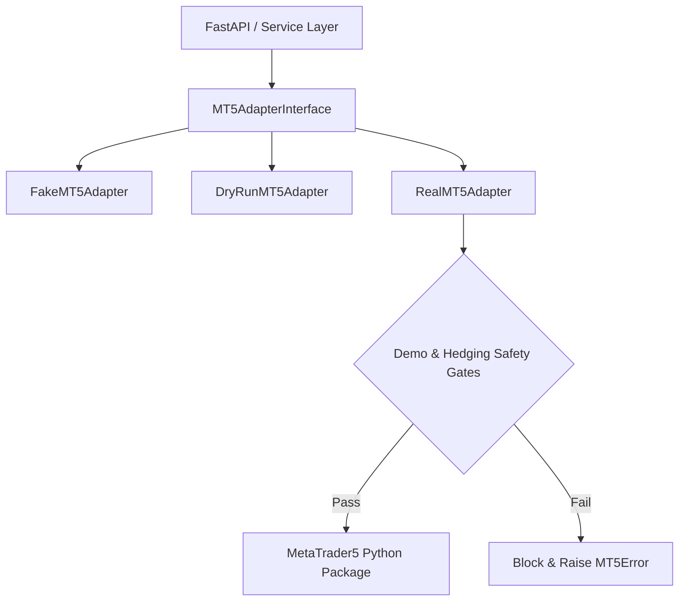

# MT5 Adapter Specification

Document Version: 1.0.0 (Phase 7 MT5 Adapter)  
Status: Approved & Implemented  

---

## 1. Overview & Adapter Architecture

The MT5 Adapter provides a unified abstract interface (`MT5AdapterInterface`) over three execution backends:
1. **`FakeMT5Adapter`** — In-memory simulation supporting 20+ scenario injections (health, live account block, netting block, send failures, fills, etc.).
2. **`DryRunMT5Adapter`** — Performs full preflight validation and request building, but never submits orders (`dry_run=true`, `execution_performed=false`).
3. **`RealMT5Adapter`** — Encapsulates the official `MetaTrader5` Python package with mandatory demo-only and hedging-mode safety gates.

---

## 2. Safety Gate Architecture

Real order execution is permitted **only** when all safety gates pass:
- `MT5_ADAPTER_MODE=real`
- `MT5_EXECUTION_ENABLED=true`
- `MT5_DEMO_ONLY=true`
- Connected account environment is `DEMO`
- Account margin mode is `HEDGING`
- `order_check` passes before `order_send`
