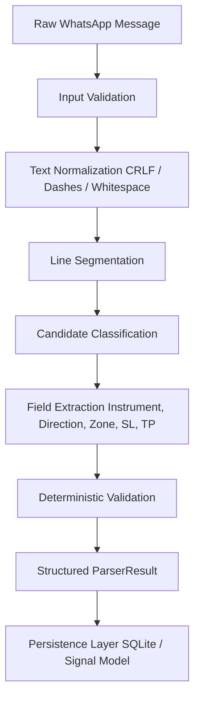

# Parser Architecture Specification

Document Version: 1.0.0 (Phase 4 Parser)  
Status: Approved & Implemented  

---

## 1. Overview & Pipeline Design

The parser engine converts incoming raw WhatsApp text messages into structured, validated, and persistence-ready data transfer objects (DTOs).

---

## 2. Guarantees & Constraints

1. **Deterministic Execution**: Given the same raw text and parser version (`1.0.0`), the parser engine produces identical results.
2. **Zero AI / LLM Dependency**: Relies purely on rule-based AST and regular expression tokenizers.
3. **Stateless Processing**: The core parsing function `parse_raw_text` operates as a pure stateless function.
4. **Decimal Safety**: All financial prices (`zoneLow`, `zoneHigh`, `stopLoss`, `tp1`, `tp2`) are parsed into `Decimal` instances and serialized as exact string decimals.

---

## 3. Module Boundaries

- `src/parser/constants.py`: Versions, supported instruments, and unicode dash constants.
- `src/parser/normalization.py`: Text cleaning, CRLF conversion, and line segmentation.
- `src/parser/patterns/`: Tokenization modules for instrument, direction, entry zone, SL, TP, and commands.
- `src/parser/classification.py`: Central precedence router and result builder.
- `src/parser/validation.py`: Validation issue codes and severity catalog.
- `src/parser/service.py`: Transactional persistence manager using `UnitOfWork`.
