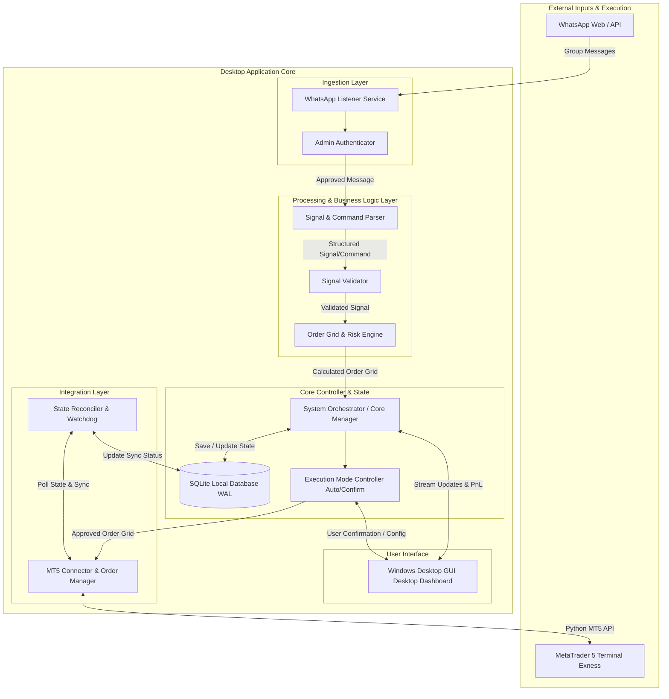

# WhatsApp MT5 XAUUSD Signal Trading Application
## System Requirements & Architecture Specification (Freeze Version)

---

## 1. Executive Summary & Objective

The objective of this project is to build a high-reliability, production-oriented Windows desktop application that listens to signals from a single approved WhatsApp group administrator, parses complex XAUUSD trading signals and follow-up management commands, calculates an evenly distributed pending order grid across the signal entry zone, and executes/manages orders on a MetaTrader 5 (MT5) Exness hedging account.

The system emphasizes safety, zero-duplicate execution, full transaction logging, crash recovery, and flexible execution modes (Fully Automatic vs Confirmation-Based UI).

---

## 2. Requirement Formalization

### 2.1 WhatsApp Ingestion & Sender Verification
- **R-WA-01**: The application shall connect to WhatsApp using one dedicated account.
- **R-WA-02**: The application shall bind exclusively to **one user-selected WhatsApp group**.
- **R-WA-03**: The application shall enforce strict **Admin Authorization**, rejecting signals and follow-up messages from any sender other than the designated group administrator phone number/JID.
- **R-WA-04**: The application shall listen continuously to real-time incoming group messages with minimal latency (< 500ms).
- **R-WA-05**: The application shall maintain session state locally to prevent repeated QR code scans across app restarts.

### 2.2 Signal & Follow-up Command Parsing
- **R-PRS-01**: The system shall detect **XAUUSD / Gold** trade signals containing:
  - Symbol: `Gold`, `XAUUSD`, `XAUUSD.` etc.
  - Action: `Buy` or `Sell` (Case-insensitive).
  - Entry Range: Single price (e.g., `4120`) or Range (e.g., `4120-4128` or `4120 - 4128`).
  - Stop Loss (SL): Explicit price (e.g., `sl - 4136`, `SL: 4136`).
  - Take Profit (TP): One or multiple levels (e.g., `tp - 4112`, `tp - 4104`, `tp - Open`).
- **R-PRS-02**: The system shall support follow-up management commands related to active signals:
  - Move Stop Loss (e.g., `Set SL to Break Even`, `SL to 4125`).
  - Close Partial / Full (e.g., `Close Half`, `Close All`, `Close TP1`).
  - Delete / Cancel Pending Orders (e.g., `Cancel Gold Sell`).
- **R-PRS-03**: The system shall parse messy whitespace, variable casing, and common symbol synonyms for Gold/XAUUSD.
- **R-PRS-04**: Unparseable or ambiguous messages shall be flagged, logged, and ignored or presented for manual user review without throwing unhandled exceptions.

### 2.3 Order Grid & Risk Management Engine
- **R-ORD-01**: For an entry range (e.g., `4120-4128`), the system shall generate a grid of **N evenly spaced pending orders** (Limit/Stop orders depending on current market price vs zone).
- **R-ORD-02**: Total lot size or risk per grid level shall be calculated based on user-configured risk settings (Fixed Lot per order, Total Lot split equally across grid, or % Account Risk).
- **R-ORD-03**: Each order in the grid shall assign its corresponding TP level(s) or standard exit rules.
- **R-ORD-04**: For `TP - Open`, the order shall have no initial hard TP set on MT5 (or set to a far target) and will rely on dynamic management commands or manual close.
- **R-ORD-05**: All pending orders for a given signal shall share a unified Signal ID tracked via MT5 Magic Number and Order Comments.

### 2.4 MetaTrader 5 Integration (Exness XAUUSD)
- **R-MT5-01**: The system shall connect to MetaTrader 5 desktop terminal via the official Python `MetaTrader5` library on Windows.
- **R-MT5-02**: Target instrument: **XAUUSD** (handling broker suffix variants like `XAUUSDm` on Exness).
- **R-MT5-03**: Support **MT5 Hedging Accounts** (allowing multiple simultaneous buy/sell positions and individual pending order management).
- **R-MT5-04**: Perform automated order placement, modification (SL/TP update), partial closing, and deletion of pending orders.
- **R-MT5-05**: Implement continuous connection status monitoring and auto-reconnect logic.

### 2.5 Execution Modes & UI Controls
- **R-EXEC-01 (Fully Automatic)**: Signal -> Parse -> Auto-Grid Calculation -> Direct Order Placement in MT5.
- **R-EXEC-02 (Confirmation Mode)**: Signal -> Parse -> Display UI Alert/Modal with proposed orders & parameters -> User clicks "Approve" / "Reject" -> Execute in MT5 upon Approval.
- **R-EXEC-03**: Modern Windows Desktop Interface (GUI) providing real-time signal stream, active pending grid overview, open position P&L tracking, MT5 status dashboard, and manual override controls.

### 2.6 Persistence, Idempotency & Recovery
- **R-DB-01**: Local SQLite database with WAL (Write-Ahead Logging) mode to persist:
  - Raw WhatsApp messages & audit trail.
  - Parsed signals & validation outcomes.
  - Generated grid orders & mapping to MT5 Ticket IDs.
  - Execution logs & state updates.
- **R-DB-02 (Idempotency)**: Each WhatsApp message ID is uniquely indexed; duplicate messages from WhatsApp re-transmissions are detected and rejected.
- **R-DB-03 (Crash Recovery)**: Upon restart, the application queries MT5 active orders/positions, reconciles with the local database state, and resumes tracking without duplicating trades or losing pending signal context.

---

## 3. System Architecture & Component Design

### 3.1 High-Level Architectural Diagram



### 3.2 Component Layer Breakdown

1. **WhatsApp Ingestion Engine (`whatsapp/`)**:
   - Manages connection session and authentication.
   - Filters incoming traffic by group ID and verified admin phone number.
   - Dispatches raw authorized message payloads to Orchestrator.

2. **Parser & Signal Engine (`parser/`)**:
   - Regular Expressions & AST parser for trading signals and follow-up actions.
   - Output: Immutable `ParsedSignal` or `FollowUpCommand` data structure.

3. **Risk & Grid Calculation Engine (`grid/`)**:
   - Accepts entry price range `[P_min, P_max]`, number of grid levels `N`, lot allocation rules.
   - Calculates step size: $\Delta P = \frac{P_{max} - P_{min}}{N - 1}$.
   - Determines pending order types (`BUY_LIMIT`, `SELL_LIMIT`, `BUY_STOP`, `SELL_STOP`) relative to live market price.

4. **MetaTrader 5 Bridge (`mt5/`)**:
   - Wraps `MetaTrader5` Python API with async/thread safety.
   - Translates app orders into `trade_request` dictionaries (`TRADE_ACTION_PENDING`, `TRADE_ACTION_SLTP`, `TRADE_ACTION_DEAL`).
   - Standardizes symbol names (`XAUUSD`, `XAUUSDm`).

5. **Persistence & Database Core (`database/`)**:
   - SQLite tables: `raw_messages`, `signals`, `orders`, `positions`, `system_logs`, `app_config`.
   - Transactional persistence before sending requests to broker.

6. **Execution Controller & UI (`gui/` & `core/`)**:
   - Manages execution workflow (Auto vs Approval Queue).
   - Desktop UI showing active signals, live log ticker, grid preview modal, MT5 heartbeat.

---

## 4. Module Specifications & Interfaces

### 4.1 Modular Directory Layout
```text
whatsapp_trading_bot/
├── docs/
│   └── REQUIREMENTS_AND_ARCHITECTURE.md
├── src/
│   ├── core/
│   │   ├── __init__.py
│   │   ├── config.py
│   │   ├── orchestrator.py
│   │   └── models.py
│   ├── whatsapp/
│   │   ├── __init__.py
│   │   ├── client.py
│   │   └── admin_verifier.py
│   ├── parser/
│   │   ├── __init__.py
│   │   ├── signal_parser.py
│   │   └── command_parser.py
│   ├── grid/
│   │   ├── __init__.py
│   │   └── grid_calculator.py
│   ├── mt5/
│   │   ├── __init__.py
│   │   ├── bridge.py
│   │   └── reconciler.py
│   ├── database/
│   │   ├── __init__.py
│   │   ├── db_manager.py
│   │   └── repository.py
│   └── gui/
│       ├── __init__.py
│       ├── app.py
│       └── components/
└── tests/
    ├── test_parser.py
    ├── test_grid.py
    └── test_admin.py
```

### 4.2 Core Data Models (Interface Specification)

```python
from dataclasses import dataclass, field
from enum import Enum
from typing import List, Optional
from datetime import datetime

class TradeDirection(Enum):
    BUY = "BUY"
    SELL = "SELL"

class ExecutionMode(Enum):
    AUTO = "AUTO"
    CONFIRMATION = "CONFIRMATION"

class SignalStatus(Enum):
    PENDING_APPROVAL = "PENDING_APPROVAL"
    APPROVED = "APPROVED"
    REJECTED = "REJECTED"
    EXECUTED = "EXECUTED"
    FAILED = "FAILED"
    CANCELLED = "CANCELLED"

class OrderType(Enum):
    BUY_LIMIT = "BUY_LIMIT"
    SELL_LIMIT = "SELL_LIMIT"
    BUY_STOP = "BUY_STOP"
    SELL_STOP = "SELL_STOP"

@dataclass(frozen=True)
class RawMessage:
    id: str
    group_id: str
    sender_id: str
    timestamp: datetime
    content: str
    is_admin: bool

@dataclass
class ParsedSignal:
    raw_message_id: str
    symbol: str
    direction: TradeDirection
    entry_min: float
    entry_max: float
    stop_loss: float
    take_profits: List[Optional[float]] # None indicates 'Open'
    raw_text: str
    timestamp: datetime

@dataclass
class PendingGridOrder:
    signal_id: str
    grid_index: int
    price: float
    volume: float
    order_type: OrderType
    stop_loss: float
    take_profit: Optional[float]
    status: str = "PENDING"
    mt5_ticket: Optional[int] = None

@dataclass
class FollowUpCommand:
    raw_message_id: str
    target_symbol: str
    action_type: str # e.g. MOVE_SL, CLOSE_PARTIAL, CANCEL_PENDING
    params: dict
    timestamp: datetime
```

---

## 5. Acceptance Criteria

### Scenario 1: Standard Signal Parsing & Approval (Auto Mode)
- **Given**: WhatsApp Client is connected and Execution Mode is `AUTO`.
- **When**: Admin posts:
  ```text
  Gold Sell
  4120-4128
  sl - 4136
  tp - 4112
  tp - 4104
  tp - Open
  ```
- **Then**:
  1. Admin Verifier validates sender phone matches Admin configuration.
  2. Signal Parser extracts `XAUUSD`, `SELL`, range `4120.0` to `4128.0`, `SL=4136.0`, `TPs=[4112.0, 4104.0, None]`.
  3. Grid Generator splits the entry range into configured $N$ levels with equal lot distribution.
  4. Database persists the signal and pending grid order records.
  5. MT5 Bridge submits $N$ limit orders to MT5 with corresponding SL/TP settings.
  6. Desktop UI updates live view showing created pending grid orders and tickets.

### Scenario 2: Non-Admin Signal Injection
- **Given**: WhatsApp Client is connected.
- **When**: Non-admin group member posts a trade signal format message.
- **Then**:
  1. Admin Verifier rejects the message based on sender JID.
  2. System logs security event: "Ignored message from unauthorized sender".
  3. No parser processing or MT5 order placement occurs.

### Scenario 3: Confirmation Mode Execution
- **Given**: Execution Mode is set to `CONFIRMATION`.
- **When**: Admin posts a valid Gold Buy signal.
- **Then**:
  1. Signal is parsed and grid calculated.
  2. Signal status is set to `PENDING_APPROVAL`.
  3. Desktop UI displays a high-visibility modal showing signal details and grid lines.
  4. No MT5 orders are placed until user clicks "Approve". If user clicks "Reject", signal status changes to `REJECTED` and no orders are placed.

### Scenario 4: App Restart Recovery
- **Given**: App had 3 pending grid orders active on MT5 before abnormal shutdown.
- **When**: App restarts.
- **Then**:
  1. Reconciler connects to local DB and MT5 terminal.
  2. Matches live MT5 magic number orders against database records.
  3. Restores in-memory state tracking seamlessly without duplicating orders.

---

## 6. Unresolved Trading-Rule Decisions (Open Questions for User Review)

Before proceeding to Prompt 2, the following decision points require user clarification:

1. **Grid Level Count ($N$) & Lot Allocation**:
   - How many grid levels $N$ should be created across an entry range (e.g., 3 levels, 5 levels)?
   - Should total lot size (e.g., 0.15 lots) be split evenly across grid lines (0.05 lot each), or should each grid line carry a fixed lot size?
2. **TP Allocation across Grid Lines**:
   - When multiple TPs are provided (e.g., TP1=4112, TP2=4104, TP3=Open), how are TPs mapped to grid orders?
     - *Option A*: Each grid order is split into 3 micro-orders, one for each TP.
     - *Option B*: Grid line 1 gets TP1, Grid line 2 gets TP2, Grid line 3 gets TP3/Open.
3. **`TP - Open` Handling**:
   - When TP is set to `Open`, should MT5 order be sent with `tp = 0.0` (relying on manual close / follow-up command), or a wide default pips target?
4. **Current Price vs Entry Range Handling**:
   - If market price is already inside the 4120-4128 range when signal arrives:
     - Should orders above market be SELL LIMIT and below market be SELL STOP, or should market orders be placed for levels already crossed?
5. **Confirmation Mode Timeout**:
   - If Confirmation Mode is active and user does not click Approve/Reject within $X$ minutes, should the signal expire or remain pending?

---
*End of Prompt 1 Deliverable — Specification Frozen.*
