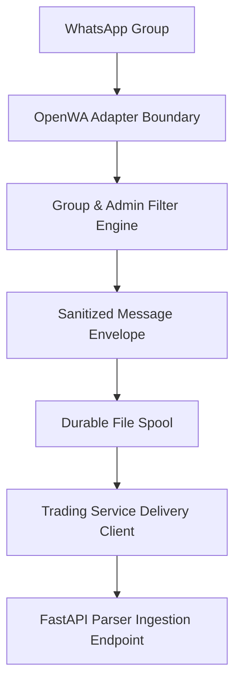

# WhatsApp Worker Architecture & Adapter Specification

Document Version: 1.0.0 (Phase 8 WhatsApp Worker)  
Status: Approved & Implemented  

---

## 1. Overview & Adapter Architecture

The OpenWA WhatsApp Ingestion Worker is an isolated Node.js TypeScript daemon operating as an ingestion adapter only.

---

## 2. Non-Negotiable Boundaries

- Worker NEVER connects to MT5.
- Worker NEVER accesses SQLite business database directly.
- Worker NEVER calls campaign approval or trade execution endpoints.
- Worker operates in `fake` adapter mode by default.
